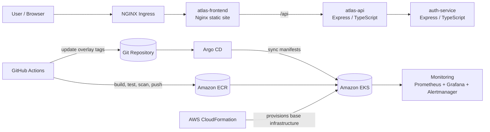

# Atlas Platform

Atlas Platform is a learning-oriented cloud platform project that packages a small microservice application with the surrounding platform work needed to run it on AWS EKS. The repo covers infrastructure provisioning, Kubernetes bootstrap, GitOps deployment with Argo CD, ingress, monitoring, and promotion workflows across `dev`, `staging`, and `prod`.

At the application layer, the platform exposes a frontend, routes browser traffic into an internal API, and keeps the auth service private inside the cluster.

## Architecture



## What is in the repo

- `services/atlas-api` - Express TypeScript API service
- `services/auth-service` - internal auth validation service
- `services/frontend` - static frontend served by Nginx, proxies `/api/` to the API service
- `deploy/k8s` - base manifests, service-specific manifests, and environment overlays
- `deploy/bootstrap` - namespace, quota, limit range, and baseline network policy bootstrap
- `deploy/argocd` - Argo CD project and application definitions
- `deploy/monitoring` - Prometheus/Grafana installation assets
- `infra/cloudformation` - AWS infrastructure stacks and environment parameters
- `docs/architecture` - phase-by-phase platform build notes
- `docs/runbooks.md` - troubleshooting and operational runbooks
- `.github/workflows` - CI build and environment promotion workflows

## Current platform shape

- Frontend is the only service intended to be exposed externally.
- `atlas-api` stays internal to the cluster.
- `auth-service` stays internal to the cluster.
- Environment separation is handled with Kubernetes namespaces: `atlas-dev`, `atlas-staging`, `atlas-prod`.
- GitOps sync is driven by Argo CD from this repository.
- Monitoring is installed with `kube-prometheus-stack`.

## Services

### `atlas-api`

The API is an Express service with health and readiness endpoints and environment/version metadata. It listens on `PORT` and binds to `0.0.0.0`.

Useful endpoints:

- `/health`
- `/ready`
- `/version`

### `auth-service`

The auth service is a small internal service used for token validation style checks.

Useful endpoints:

- `/health`
- `/validate`

### `frontend`

The frontend is served by Nginx on port `8080`. Requests to `/api/` are proxied to `atlas-api.atlas-dev.svc.cluster.local`, which makes the frontend the browser-facing entry point.

## Delivery flow

1. Infrastructure is provisioned from `infra/cloudformation`.
2. Cluster bootstrap applies namespaces, quotas, limits, and baseline policies from `deploy/bootstrap`.
3. Argo CD watches this repo and syncs manifests from `deploy/argocd` and `deploy/k8s`.
4. GitHub Actions builds the API image, runs lint/test/build, scans it, pushes it to ECR, and updates the dev overlay tag.
5. Separate promotion workflows update the `staging` and `prod` overlay tags.

## Environment model

The Kubernetes deployment layout follows a base-plus-overlay structure:

- `deploy/k8s/base` - shared API deployment, service, and config
- `deploy/k8s/overlays/dev`
- `deploy/k8s/overlays/staging`
- `deploy/k8s/overlays/prod`

The `dev` overlay currently sets the namespace to `atlas-dev`, pins the ECR image, and scales the API to two replicas.

## Prerequisites

You will need these tools available locally:

- `node` and `npm`
- `docker`
- `kubectl`
- `helm`
- `aws` CLI

You will also need:

- an AWS account with access to the resources referenced by the CloudFormation and ECR setup
- a Kubernetes context pointed at the target EKS cluster
- GitHub secrets configured for the CI workflows if you want to use the repo automation as-is

## Local development

Each Node service is self-contained and can be worked on independently.

Example for the API service:

```bash
cd services/atlas-api
npm ci
npm run lint
npm test
npm run build
```

Example for the auth service:

```bash
cd services/auth-service
npm ci
npm run lint
npm test
npm run build
```

## Infrastructure and cluster setup

### 1. Provision AWS infrastructure

The CloudFormation entrypoint is:

```bash
./infra/cloudformation/deploy.sh dev
```

Parameter files exist for:

- `infra/cloudformation/parameters/dev.json`
- `infra/cloudformation/parameters/staging.json`
- `infra/cloudformation/parameters/prod.json`

### 2. Bootstrap the cluster

Apply the baseline Kubernetes bootstrap manifests from `deploy/bootstrap` after the cluster is available. This layer establishes namespaces, limit ranges, quotas, and deny-by-default network policy intent.

See [deploy/bootstrap/README.md](/Users/kwakurich/Documents/Tutorials/Atlas%20Platform/deploy/bootstrap/README.md).

### 3. Install Argo CD app definitions

Argo CD resources live under `deploy/argocd`:

- `deploy/argocd/projects/atlas-project.yaml`
- `deploy/argocd/root/root-app.yaml`
- `deploy/argocd/apps/*.yaml`

The root app points Argo CD at this repository and the `deploy/argocd/apps` path.

### 4. Install ingress

Ingress for the frontend is defined in [deploy/k8s/frontend/ingress.yaml](/Users/kwakurich/Documents/Tutorials/Atlas%20Platform/deploy/k8s/frontend/ingress.yaml). The intended traffic flow is:

`internet -> ingress -> atlas-frontend -> atlas-api -> auth-service`

See [docs/architecture/phase-14-ingress-controller.md](/Users/kwakurich/Documents/Tutorials/Atlas%20Platform/docs/architecture/phase-14-ingress-controller.md) and [docs/runbooks.md/ingress-debug.md](/Users/kwakurich/Documents/Tutorials/Atlas%20Platform/docs/runbooks.md/ingress-debug.md).

### 5. Install monitoring

Monitoring assets are in `deploy/monitoring`.

Install:

```bash
./deploy/monitoring/install-monitoring.sh
```

Access Grafana locally:

```bash
./deploy/monitoring/port-forward-grafana.sh
```

See [deploy/monitoring/README.md](/Users/kwakurich/Documents/Tutorials/Atlas%20Platform/deploy/monitoring/README.md).

## CI/CD

The repository currently includes:

- `api-build.yml` - builds, tests, scans, pushes the API image, and updates the dev overlay
- `promote-staging.yml` - promotes a chosen image tag to staging
- `promote-prod.yml` - promotes a chosen image tag to production

This gives you a simple promotion model:

- merge or push relevant API changes to `main`
- let CI build and publish the image
- promote the resulting image tag forward through overlays
- let Argo CD reconcile the target environment

## Documentation

- Architecture notes: [docs/architecture](/Users/kwakurich/Documents/Tutorials/Atlas%20Platform/docs/architecture)
- Runbooks: [docs/runbooks.md](/Users/kwakurich/Documents/Tutorials/Atlas%20Platform/docs/runbooks.md)
- Monitoring docs: [deploy/monitoring/README.md](/Users/kwakurich/Documents/Tutorials/Atlas%20Platform/deploy/monitoring/README.md)
- Bootstrap docs: [deploy/bootstrap/README.md](/Users/kwakurich/Documents/Tutorials/Atlas%20Platform/deploy/bootstrap/README.md)

## Notes

- This repository is structured as a platform tutorial and build-out, so some operational details are intentionally simple for learning.
- Monitoring credentials in the current learning-phase docs are intentionally basic and should be hardened before any real shared use.
- Several docs describe the intended secure network posture even where EKS enforcement details still depend on cluster configuration.
